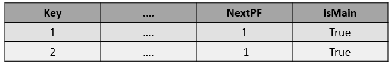

# Proyecto 1: Organización de Archivos

## Lista de actividades:

| Integrante                         | Tareas                 |
|-----------------------------------|------------------------------|
| Coorahua Peña, Ruben Aaron        |                              |
| Golac Córdova, Luis David         |                              |
| Loza Mendoza, Sebastián           |                              |
| Pajuelo Reyes, César Eduardo      |                              |
| Rodríguez Gutiérrez, Gonzalo Alonso|                             |

## Introducción

En la era actual de la información, la gestión eficiente de datos es esencial para empresas, organizaciones y aplicaciones en una amplia variedad de dominios. El acceso rápido y preciso a los datos es un componente crítico para garantizar el funcionamiento efectivo de sistemas de información.

### Objetivos

El objetivo principal de este proyecto es comprender en profundidad tres técnicas de organización de archivos en memoria secundaria, las cuales serán:

* Sequential File
* AVL File
* B+ Tree

Cada una de estas técnicas se implementará y se evaluará en función de su capacidad para realizar operaciones de inserción, búsqueda y eliminación de datos.

Los objetivos secundarios son diseñar una interfaz de usuario (GUI) que permita a los usuarios interactuar con las técnicas de indexación a través de consultas SQL y visualizar los resultados.

### Descripción de datos

Para llevar a cabo este proyecto, se han seleccionado dos conjuntos de datos reales de Kaggle, una plataforma que proporciona datos variados. Estos datos representarán el dominio en el que aplicaremos técnicas de indexación para mejorar la eficiencia en la recuperación de información.

### Resultados esperados

Se realizarán pruebas experimentales que medirán el rendimiento de las técnicas de indexación en términos de accesos a disco duro y tiempo de ejecución. Estas pruebas proporcionarán información valiosa sobre cuál de las técnicas es más adecuada.

## Técnicas utilizadas:

### Sequential File

El Sequential File es un sistema de organización de archivos en donde se usa 2 archivos un main y un aux. El main contiene los registros ordenados por un key, cada registro contiene información de la posición y lugar en donde se encuentra el siguiente. En este caso se utilizó unos registros de longitud fija. 

#### Inserción:

La operación de inserción en un Sequential File comienza buscando el registro más cercano al valor clave (key) del registro que se va a insertar mediante una búsqueda binaria. Luego, utilizando la información de los campos "nextPF" y "isMain", avanzamos al registro siguiente, continuando hasta que regresemos al archivo principal (Main) o encontremos un registro con un valor clave mayor al del registro que deseamos insertar.

  

Una vez encontrada la posición adecuada, insertamos el nuevo registro. Para ello, copiamos los valores de "nextPF" e "isMain" del último registro obtenido en el registro que estamos insertando. Luego, modificamos el campo "nextPF" del último registro obtenido, asignándole la última posición del archivo auxiliar más uno, y establecemos el campo "isMain" en falso.

  

Existen casos especiales que debemos considerar. Uno de ellos es cuando el registro que queremos insertar es menor que todos los registros en el archivo principal. En este caso, utilizamos el encabezado del archivo para acceder al registro más pequeño. Otro caso especial es cuando el archivo principal está vacío, en cuyo caso, automáticamente colocamos el nuevo registro en el archivo principal.

El límite máximo de registros que puede soportar el archivo auxiliar está definido por el logaritmo del tamaño del archivo principal. Si se supera este límite, se realiza una operación de fusión (merge) entre ambos archivos para mantener la eficiencia del sistema, y posteriormente se procede con la inserción del nuevo registro.

#### Búsqueda:

La búsqueda de un registro comienza en el archivo principal (main) y utiliza el algoritmo de búsqueda binaria para localizar el registro deseado o el registro más cercano al valor clave (key). Si el key del registro buscado se encuentra en el archivo principal, se devuelve la información correspondiente. Si no se encuentra en el archivo principal, se inicia un proceso de búsqueda lineal utilizando la información de los campos "nextPF" e "isMain" para encontrar el registro deseado.

En caso de no encontrar un registro con un valor clave igual al buscado durante la búsqueda lineal, se verifica si el campo "isMain" es verdadero en el registro actual. Si es así, se concluye que el registro buscado no existe en la base de datos.

#### Merge:

La operación de merge es específica para el Sequential File y se utiliza para combinar los archivos principales (main) y auxiliares en momentos específicos. El algoritmo comienza leyendo la información del encabezado que indica la posición del primer registro. Luego, busca el registro en el archivo correspondiente, determinado por el valor booleano "isMain" (1 si está en el main y 0 si está en el auxiliar). Una vez encontrado el registro, se escribe en un nuevo archivo y se actualizan los valores de "isMain" y "nextPos" con los valores de esos atributos que se encontraban en el registro recién escrito en el nuevo archivo. Este proceso se repite hasta que "nextPos" sea igual a '-1', lo que indica que se ha llegado al último registro.

#### Eliminación:

En el caso de la eliminación, los archivos principales y auxiliares se combinan en uno solo para facilitar el acceso al registro anterior y posterior al que se desea eliminar. Al combinarlos, se ordenan completamente los registros, lo que permite encontrar fácilmente el registro anterior al que se va a eliminar. Luego, se realiza una búsqueda binaria basada en el valor clave del registro que se desea eliminar para encontrar su posición en el archivo y, en consecuencia, la posición del registro anterior. Con estas dos posiciones, se actualiza el atributo "nextPF" del registro anterior al que se quiere eliminar con el valor del siguiente registro al que se quiere eliminar. Por último, se actualiza el "nextPF" del registro a eliminar con '-2', lo que indica que el registro ha sido eliminado.

#### Complejidades:

### AVL File:

#### Inserción:

#### Búsqueda:

#### Eliminación:

#### Complejidades:

### B+ Tree:

#### Inserción:

#### Búsqueda:

#### Eliminación:

#### Complejidades:

### Parser SQL:

## Resultados Experimentales:

### Cuadro comparativo:

### Conclusiones:
