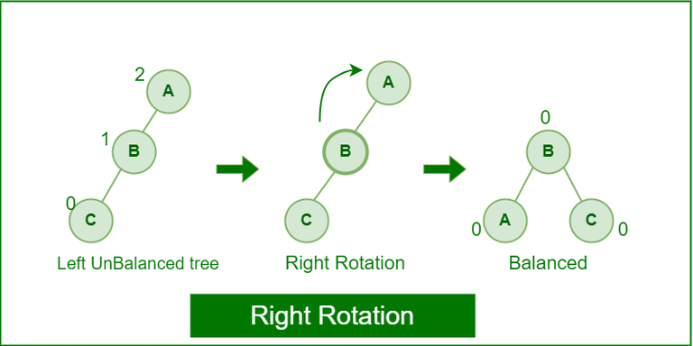

# Proyecto 1: Organización de Archivos

## Lista de actividades:

| Integrante                         | Tareas                 |
|-----------------------------------|------------------------------|
| Coorahua Peña, Ruben Aaron        |                              |
| Golac Córdova, Luis David         |                              |
| Loza Mendoza, Sebastián           |                              |
| Pajuelo Reyes, César Eduardo      |                              |
| Rodríguez Gutiérrez, Gonzalo Alonso|                             |

## Introducción

En la era actual de la información, la gestión eficiente de datos es esencial para empresas, organizaciones y aplicaciones en una amplia variedad de dominios. El acceso rápido y preciso a los datos es un componente crítico para garantizar el funcionamiento efectivo de sistemas de información.

### Objetivos

El objetivo principal de este proyecto es comprender en profundidad tres técnicas de organización de archivos en memoria secundaria, las cuales serán:

* Sequential File
* AVL File
* B+ Tree

Cada una de estas técnicas se implementará y se evaluará en función de su capacidad para realizar operaciones de inserción, búsqueda y eliminación de datos.

Los objetivos secundarios son diseñar una interfaz de usuario (GUI) que permita a los usuarios interactuar con las técnicas de indexación a través de consultas SQL y visualizar los resultados.

### Descripción de datos

Para llevar a cabo este proyecto, se han seleccionado dos conjuntos de datos reales de Kaggle, una plataforma que proporciona datos variados. Estos datos representarán el dominio en el que aplicaremos técnicas de indexación para mejorar la eficiencia en la recuperación de información.

### Resultados esperados

Se realizarán pruebas experimentales que medirán el rendimiento de las técnicas de indexación en términos de accesos a disco duro y tiempo de ejecución. Estas pruebas proporcionarán información valiosa sobre cuál de las técnicas es más adecuada.

## Técnicas utilizadas:

### Sequential File

El Sequential File es un sistema de organización de archivos en donde se usa 2 archivos un main y un aux. El main contiene los registros ordenados por un key, cada registro contiene información de la posición y lugar en donde se encuentra el siguiente. En este caso se utilizó unos registros de longitud fija. 

#### Inserción:

La operación de inserción en un Sequential File comienza buscando el registro más cercano al valor clave (key) del registro que se va a insertar mediante una búsqueda binaria. Luego, utilizando la información de los campos "nextPF" y "isMain", avanzamos al registro siguiente, continuando hasta que regresemos al archivo principal (Main) o encontremos un registro con un valor clave mayor al del registro que deseamos insertar.

  

Una vez encontrada la posición adecuada, insertamos el nuevo registro. Para ello, copiamos los valores de "nextPF" e "isMain" del último registro obtenido en el registro que estamos insertando. Luego, modificamos el campo "nextPF" del último registro obtenido, asignándole la última posición del archivo auxiliar más uno, y establecemos el campo "isMain" en falso.

  

Existen casos especiales que debemos considerar. Uno de ellos es cuando el registro que queremos insertar es menor que todos los registros en el archivo principal. En este caso, utilizamos el encabezado del archivo para acceder al registro más pequeño. Otro caso especial es cuando el archivo principal está vacío, en cuyo caso, automáticamente colocamos el nuevo registro en el archivo principal.

El límite máximo de registros que puede soportar el archivo auxiliar está definido por el logaritmo del tamaño del archivo principal. Si se supera este límite, se realiza una operación de fusión (merge) entre ambos archivos para mantener la eficiencia del sistema, y posteriormente se procede con la inserción del nuevo registro.

#### Búsqueda:

La búsqueda de un registro comienza en el archivo principal (main) y utiliza el algoritmo de búsqueda binaria para localizar el registro deseado o el registro más cercano al valor clave (key). Si el key del registro buscado se encuentra en el archivo principal, se devuelve la información correspondiente. Si no se encuentra en el archivo principal, se inicia un proceso de búsqueda lineal utilizando la información de los campos "nextPF" e "isMain" para encontrar el registro deseado.

En caso de no encontrar un registro con un valor clave igual al buscado durante la búsqueda lineal, se verifica si el campo "isMain" es verdadero en el registro actual. Si es así, se concluye que el registro buscado no existe en la base de datos.

#### Merge:

La operación de merge es específica para el Sequential File y se utiliza para combinar los archivos principales (main) y auxiliares en momentos específicos. El algoritmo comienza leyendo la información del encabezado que indica la posición del primer registro. Luego, busca el registro en el archivo correspondiente, determinado por el valor booleano "isMain" (1 si está en el main y 0 si está en el auxiliar). Una vez encontrado el registro, se escribe en un nuevo archivo y se actualizan los valores de "isMain" y "nextPos" con los valores de esos atributos que se encontraban en el registro recién escrito en el nuevo archivo. Este proceso se repite hasta que "nextPos" sea igual a '-1', lo que indica que se ha llegado al último registro.

#### Eliminación:

En el caso de la eliminación, los archivos principales y auxiliares se combinan en uno solo para facilitar el acceso al registro anterior y posterior al que se desea eliminar. Al combinarlos, se ordenan completamente los registros, lo que permite encontrar fácilmente el registro anterior al que se va a eliminar. Luego, se realiza una búsqueda binaria basada en el valor clave del registro que se desea eliminar para encontrar su posición en el archivo y, en consecuencia, la posición del registro anterior. Con estas dos posiciones, se actualiza el atributo "nextPF" del registro anterior al que se quiere eliminar con el valor del siguiente registro al que se quiere eliminar. Por último, se actualiza el "nextPF" del registro a eliminar con '-2', lo que indica que el registro ha sido eliminado.

### AVL File:

El AVL File es un sistema de organización que sigue la estrategia de un árbol binario de búsqueda balanceado. En este tipo de organización cada registro tiene un atributo "left" y "right" de tipo long que indica la posición en el archivo de su nodo izquierdo o derecho respectivamente. En este AVL File el archivo posee dos header, donde uno indica la posición del root y otro guarda la posicion del último eliminado.

| pos_root  | next_del  |          |           |            |
|-----------|-----------|----------|-----------|------------|
|   data-1  |   left-1  |  right-1 |  height-1 |  nex_del-1 |
|   data-2  |   left-2  |  right-2 |  height-2 |  nex_del-2 |
|   data-3  |   left-3  |  right-3 |  height-3 |  nex_del-3 |
|    ...    |    ...    |    ...   |    ...    |     ...    |

#### Inserción:

La operación de inserción en un AVL File consiste en insertar el registro en un nodo vacio identificado por "-1", siguiendo la estructura de AVL Tree, donde primero se busca el lugar de insertación comparando el registro de la llave con la del nodo actual para movilizarnos hasta un nodo vacio. 
Una vez encontrada la posición a donde insertar, se debe escribir en el archivo actualizando la posición del left o right del nodo anterior y escribir el nuevo nodo al final de archivo o insertando dependiendo del next_del. Si se escribe el archivo dependiendo del next_del del header, el next_del de la posición a escribir se convertira en el nuevo next_del del header y se seteara el next_del del registro actual con 0.

**Antes de insertar**

| pos_root  |     7     |          |           |            |
|-----------|-----------|----------|-----------|------------|
|   data-1  |   left-1  |  right-1 |  height-1 |  nex_del-1 |
|    ...    |    ...    |    ...   |    ...    |     ...    |
|   data-7  |   left-7  |  right-7 |  height-7 |  nex_del-7 |
|    ...    |    ...    |    ...   |    ...    |     ...    |

**Después de insertar**

|  pos_root  |  nex_del-7 |           |            |            |
|------------|------------|-----------|------------|------------|
|   data-1   |   left-1   |  right-1  |  height-1  |  nex_del-1 |
|    ...     |    ...     |    ...    |    ...     |     ...    |
|  data-new  |  left-new  | right-new | height-new |      0     |
|    ...     |    ...     |    ...    |    ...     |     ...    |

Una vez insertado el valor se debe realizar un balanceo para poder mantener la propiedad de equilibrio del árbol.
Donde en cada registro solo se cambia los left y right para el balanceo, y si en caso el balanceo afecta al root, se escribira el header del por_root.

  

**Antes de balancear afectando el root**

|    1      | next_del  |          |           |            |
|-----------|-----------|----------|-----------|------------|
|   A  |     2     |    -1    |  height-1 |  nex_del-1 |
|   B  |     3     |    -1    |  height-2 |  nex_del-2 |
|   C  |    -1     |    -1    |  height-3 |  nex_del-3 |
|    ...    |    ...    |    ...   |    ...    |     ...    |

**Después de balancear afectando el root**

|    2      | next_del  |          |           |            |
|-----------|-----------|----------|-----------|------------|
|   A  |    -1     |    -1    |  height-1 |  nex_del-1 |
|   B  |     1     |     3    |  height-2 |  nex_del-2 |
|   C  |    -1     |    -1    |  height-3 |  nex_del-3 |
|    ...    |    ...    |    ...   |    ...    |     ...    |

#### Búsqueda:

La búsqueda de un registro con respecto a la llave comienza desde el pos_root, donde comparara la llave a buscar con la llave del nodo actual, y si movilizara al left o right dependiendo del caso. Y asi seguira sucesivamente hasta encontrar un nodo que contenga la data con esa key, si en caso llega hasta a un pos_node igual a "-1" significa que el elemento búscado no existe.
Esta función retoran un `pair<Record,bool` cosa que si en caso no encuentra el elemento retorna una record vacio y false.

#### Eliminación:

La eliminación de registro en el AVL File, sigue la misma estructura que la de un AVL Tree. Buscara la posición del record con cierta key que mandemos, comparando la key con la key del nodo actual para movilizarnos hasta la posición. Una vez encontrada el registro se validara los casos de eliminación que existe, si es que tiene un nodo right y left, o solo uno de ambos o ninguno. Al momento de eliminar seguimos la estrategia LIFO para la actualización del next_del del header, cosa que insertemos nuevos valores en la posición del next_del actual.

### B+ Tree File:

En un archivo B+ Tree, los nodos hojas contienen referencias directas a los registros reales del archivo de datos y están enlazados de manera similar a una lista enlazada, lo que permite soportar búsquedas individuales y por rango de manera eficiente. Por otro lado, los nodos internos conforman el directorio del índice y no almacenan información del archivo de datos. Cada nodo interno es representado por `Node` y las hojas por el `Bucket`.
Los nodos internos estan en archivo bplus_datos.dat y las hojas en el archivo bplus_index.dat, cada archivo tiene un header next_del que representa la posición del ultimo elemento eliminado

#### Inserción:

La operación de inserción se encarga de agregar nuevos registros al árbol B+ de manera ordenada. Comienza desde la raíz del árbol y se desplaza hacia abajo siguiendo el camino adecuado según las claves. Si el nodo en el que se encuentra está lleno, se divide en dos nodos más pequeños para mantener el equilibrio del árbol. Se inserta el registro en el nodo adecuado. Si es necesario, se actualiza la clave en el nodo padre para reflejar la nueva clave máxima en el nodo insertado. Este proceso se repite desde la raíz hasta llegar a la hoja adecuada, donde finalmente se agrega el registro. Donde el root a pesar del split que pueda recibir siempre sera la línea cero, y al momento de insertar si hay un elemento eliminado escribirar donde indicar el header.

#### Búsqueda de un registro:

La búsqueda de un registro en un B+ Tree comienza desde la raíz y sigue un camino descendente a través del árbol siguiendo las claves. Comienza en la raíz y compara la clave buscada con las claves del nodo para determinar la dirección a seguir. Continúa descendiendo por el árbol, moviéndote al nodo hijo correspondiente en función de las comparaciones de claves. Repite el proceso hasta llegar a una hoja, donde se espera encontrar el registro si existe. Aqui las lecturas varian dependiendo de donde se encuentra actualmente, ya que es diferente un `Bucket` que un `Node`.

#### Búsqueda de un registro por rango:

Iniciamos la búsqueda desde el nodo raíz y descender por el árbol siguiendo las claves para encontrar el primer nodo que está dentro del rango, hasta llegar a un `Bucket` lo que indica que es hoja. A partir de la hoja, recorremos las hojas del árbol en orden, recopilando todos los registros cuyas claves están dentro del rango especificado.

#### Eliminación:

Comenzamos desde la raíz y descendemos por el árbol para encontrar el nodo que contiene el registro a eliminar. Una vez encontrado, el registro se elimina del nodo.
Si la eliminación causa que el nodo tenga muy pocos registros e incumple las propiedades del B+ Tree, se realiza redistribución o merge de nodos para mantener la estructura equilibrada. Donde la eliminación va depender si el nodo actual es un nodo interno o un nodo hoja, ya que la posicion del registro a eliminar cambiara el next_del de su respectivo archivo

### Análisis comparativo:

| Métodos      |   SequetialFile    |     AVLFile        |   B+ Tree File     |
|--------------|--------------------|--------------------|--------------------|
| Búsqueda     |    O(log n)        |             |             |
| Insercción   |    O(log n)        |            |            |
| Eliminación  |    O(log n)        |             |             |

### Análisis comparativo:

| Métodos      |   SequetialFile    |     AVLFile        |   B+ Tree File     |
|--------------|--------------------|--------------------|--------------------|
| Búsqueda     |    O(log n)        |             |             |
| Insercción   |    O(log n)        |            |            |
| Eliminación  |    O(n log n)        |             |             |

### Parser SQL:

Para este proyecto se implemento el uso de Parser SQL para poder simular en la UI ejecución de código SQL. Para poder ser posible la interpretación de sentencias mediante un input se a tenido que crear tres clase: `Token`, `Scanner` y `Parser`

Donde en la clase `Token` se encarga de establecer las palabras reservadas para el reconocimiento de sintaxis. La clase `Scanner` se encarga de leer todo el input y hacer su respectiva separación de palabras y distribuyendolas segun el `Token` y tener un mejor manejo de la consulta.
Una vez distribuido por Token, son mandados al `Parser`; el Parser sera el encargado de verificar sintaxis de ingreso y dependiendo de lo ingresado ejecutara ciertas funciónes para las diferentes consultas que podemos realizar.

## Resultados Experimentales:

### Cuadro comparativo:

### Conclusiones:
